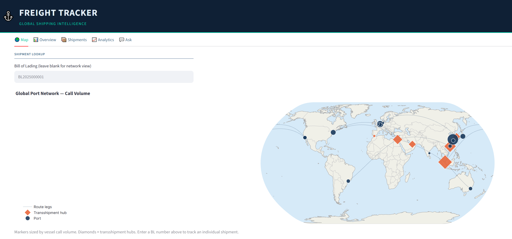

# Freight Tracker

> A container shipping intelligence dashboard — track vessels, voyages and global cargo across a relational database of 12 interconnected tables.

---

## Live Demo

*https://freighttrackergit-38rjyuqchrz5c8vkf6hy7f.streamlit.app/*

---

## Screenshot



## Features

- **Global Map** — world map with port markers sized by shipment volume and route lines between hubs
- **Shipment Tracking** — filterable table by status and trade lane, with full event timeline per Bill of Lading (Gate In → Loaded → Departed → Customs → Delivered)
- **Analytics Dashboard** — predefined charts for delay by route, on-time performance, top customers, revenue by trade lane, vessel utilization
- **Text-to-SQL** — natural language queries powered by Google Gemini 2.5 Flash (free tier); generates SQL, validates it, executes it and explains the result
- **Security** — SQL validator blocks DROP, INSERT, UPDATE, DELETE, ALTER, injection attempts and enforces LIMIT 1000

---

## Tech Stack

| Layer | Tool |
|---|---|
| Web app | Streamlit |
| Database | SQLite (12 tables, FK enforced, WAL mode) |
| Data processing | Pandas, NumPy |
| Visualisation | Plotly (scatter_geo, bar, pie, line) |
| AI / Text-to-SQL | Google Gemini 2.5 Flash |
| Testing | pytest (124 tests) |
| Deploy | Streamlit Cloud |

---

## Database Schema

12 tables organised in 4 logical groups:

**Fleet**
- `VESSEL` — container ships with IMO number, flag, capacity in TEU

**Network**
- `PORT` — 20 real global ports with UN/LOCODE codes and coordinates
- `ROUTE` — 10 shipping services (Asia-Europe, Trans-Pacific, Mediterranean)
- `ROUTE_LEG` — individual legs per route with distance in nautical miles and transit days

**Operations**
- `VOYAGE` — 60 voyages over 18 months assigned to vessels and routes
- `VOYAGE_STOP` — port calls per voyage with ETA, ATA, ETD, ATD and delay_hours

**Commercial**
- `CUSTOMER` — 15 realistic companies (Ikea, Bosch, Samsung) with tier and credit limit
- `SHIPMENT` — 200 shipments with Bill of Lading, status, incoterms, weight, declared value
- `CONTAINER` — 1-3 containers per shipment (Dry, Reefer, Open Top, Flat Rack, Tank)
- `CARGO_ITEM` — 1-4 cargo lines per container with HS codes and commodity descriptions

**Tracking**
- `SHIPMENT_EVENT` — full event chain per shipment (12 event types from booking to delivery)

---

## SQL Examples

The sql/examples/ folder contains 18 production-grade queries
that answer real business questions:

- Which routes have the highest average delay?
- What is the on-time performance trend month by month?
- Which customers generate the most freight revenue?
- How does cargo value concentrate across trade lanes?

---

## Run Locally

**1 — Clone the repository**
```bash
git clone https://github.com/YOUR_USERNAME/freight_tracker.git
cd freight_tracker
```

**2 — Create a virtual environment**
```bash
python -m venv .venv
.venv\Scripts\activate      # Windows
source .venv/bin/activate   # Mac/Linux
```

**3 — Install dependencies**
```bash
pip install -r requirements.txt
```

**4 — Get a free Gemini API key**

Go to [aistudio.google.com](https://aistudio.google.com), sign in, and create a free API key.

**5 — Create your `.env` file**
```bash
cp .env.example .env
```
Open `.env` and paste your key:
```
GEMINI_API_KEY=your_key_here
```

**6 — Run the app**
```bash
streamlit run app.py
```

Open [http://localhost:8501](http://localhost:8501) in your browser.

---

## Project Structure

```
freight_tracker/
│
├── app.py                    # Streamlit entry point (5 tabs)
│
├── modules/
│   ├── db_setup.py           # Schema + synthetic data seed (12 tables)
│   ├── query_engine.py       # Predefined SQL queries → DataFrames
│   ├── visualizer.py         # Plotly charts + world map
│   ├── text_to_sql.py        # Natural language → SQL via Gemini API
│   └── validator.py          # SQL security validator
│
├── sql/
│   ├── schema.sql            # DDL — readable schema for recruiters
│   ├── seed_queries.sql      # Post-seed verification queries
│   └── examples/
│       ├── joins.sql         # JOIN showcase (6 queries)
│       ├── window_functions.sql  # Window functions showcase (6 queries)
│       └── analytics.sql     # Analytical queries showcase (6 queries)
│
├── tests/
│   ├── test_db_setup.py      # DB integrity, FK, idempotency
│   ├── test_query_engine.py  # All KPI functions
│   └── test_text_to_sql.py   # Validator + ConversationHistory + ask()
│
├── assets/
│   └── style.css             # Dark maritime theme
│
├── data/
│   └── database.db           # SQLite database (generated on first run)
│
├── conftest.py               # pytest path configuration
├── .env.example              # API key template
├── requirements.txt
└── README.md
```

---

## Testing

```bash
pytest tests/ -v
```

```
124 passed in 2.41s
```

Test coverage includes:
- Schema integrity and FK validation
- Idempotency of `init_db()`
- All KPI query functions return non-empty DataFrames with expected columns
- SQL validator blocks dangerous statements (DROP, INSERT, UPDATE, DELETE, ALTER, PRAGMA, ATTACH)
- LIMIT injection and clamping
- ConversationHistory lifecycle (add, clear, limit, remaining)
- API mock for `ask()` function

---

## Project Notes & Data Insights

For this project I wanted to build a container shipping tracker covering the main global routes, ports,
vessels and cargo flows. Rather than sourcing real data (which would have required cleaning, licensing and significant
time) I designed the 12-table schema first and then used AI to generate realistic synthetic data following actual
shipping patterns: real port coordinates, real vessel names, geographically coherent routes and a delay distribution
that reflects what happens in practice.
The dataset covers 60 voyages across 18 months, 200 shipments, 10 vessels and 20 global ports.

**Delays by route**

Every route shows some level of delay, which reflects reality. The US West–Asia corridor is the most challenged at 5.8h
average delay with only 41% on-time performance. Asia–Australia and Asia–US East Coast follow at 4.6h and 4.9h
respectively. The best performer is Asia–Mediterranean at 2.8h average delay and 75% OTP, the shortest of the long-haul
routes.

Overall fleet OTP sits at 64.1%, with 34.3% of port calls experiencing moderate delays (4–24h) and a small fraction
severely delayed over 24h.

**Revenue by trade lane** 

South America–Europe leads at $22.3M, followed closely by US West–Asia ($21.0M) and Asia–North Europe ($20.9M).
The distribution is remarkably even across trade lanes, with all major routes sitting between $18M and $23M, suggesting
balanced booking across the network.

**Customers**

IKEA Supply AG is the top customer by shipment value, followed by Nestlé, Siemens AG and Samsung Electronics. 
The top 10 customers span multiple industries (Furniture, Food & Beverage, Machinery, Electronics, Apparel) reflecting
a diversified customer base. Notably, no single customer dominates the others significantly: the value range between
the first and tenth customer is relatively narrow, which in a real scenario would indicate low dependency risk on any
single account.

**Shipment status**

95.5% of shipments are Delivered, with only 3% still In Transit and 1.5% Booked but not yet loaded. In value terms,
the pipeline still in progress represents approximately $9.1M ($4.9M in transit and $4.2M booked) which is a small
but visible share of total cargo value. This distribution is consistent with a simulation that covers a mostly
completed 18-month window.

**Vessel utilization**

Most vessels completed 6 voyages over the 18-month window. Three vessels (PIL Karimun, Yangming Triumph and
ZIM Integrated) show 1 active voyage still in progress, consistent with the simulation cutoff date.


*All data in this project is synthetic. Port coordinates, vessel names and company names are real, but shipment
volumes, cargo values, delays and routes have been generated algorithmically to simulate plausible patterns. 
The insights above reflect the statistical distribution built into the seed logic and should not be interpreted
as real-world shipping intelligence.*


---

## Author

Built by **Davide Boccardo** — Data Analyst & Python Developer based in Turin, Italy.

[LinkedIn](https://www.linkedin.com/in/davide-boccardo-6775a6125/) • [GitHub](https://github.com/davide-bocc)